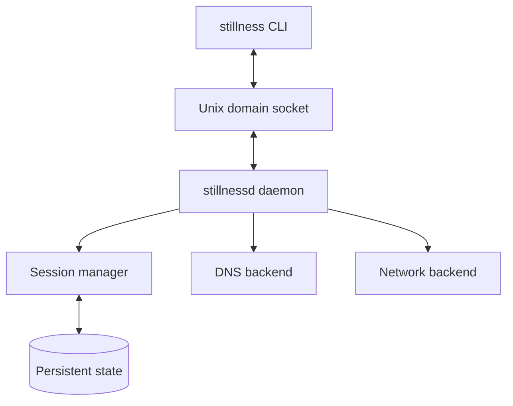

# Stillness architecture

```mermaid
flowchart TD
    CLI["stillness CLI"]
    IPC["Unix domain socket"]
    DAEMON["stillnessd daemon"]
    SESSION["Session manager"]
    STATE[("Persistent state")]
    DNS["DNS backend"]
    NET["Network backend"]

    CLI <--> IPC
    IPC <--> DAEMON
    DAEMON --> SESSION
    SESSION <--> STATE
    DAEMON --> DNS
    DAEMON --> NET
```